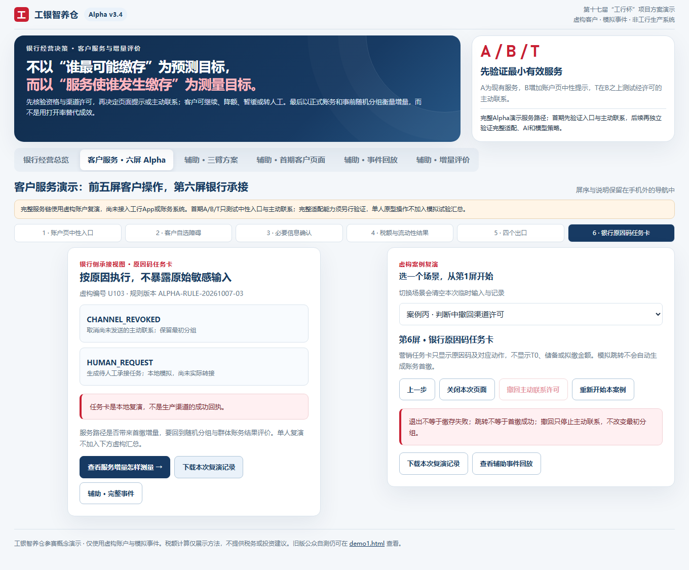

# 工银智养仓：个人养老金开户后服务优化

**一个围绕服务流程、客户保护与试点投入判断的金融咨询案例。** 从“已开户、尚未首缴”的问题出发，比较说明入口与获准主动联系的增量价值，并用问卷复核、成本模型和规则原型检验方案。

作者：吕滢滢｜广东金融学院 · 金融科技｜案例整理日期：2026-10-10

[体验公开原型](https://yumm-del.github.io/gongyin-zhiyangcang-public-selftest/demo2.html) · [阅读决策报告](consulting-case/docs/养老金咨询案例-咨询决策报告-v1.md) · [查看证据索引](consulting-case/evidence-index.md) · [复现说明](consulting-case/reproduce.md)

本案例由个人参赛方案延展而来，研究中的银行为假设客户。现有材料支持问题诊断、方案设计与本地测试；真实银行效果、成本和生产控制仍待验证。

## 业务问题与当前建议

银行是否应为已开户、尚未首缴的客户增加说明入口和主动联系？怎样避免用开户数、点击数或模拟结果替代真实增量价值？

**当前建议：先核验数据、服务流程与保护控制，再决定是否进入受控试点。现有证据不足以支持扩大主动联系。**

| 方案 | 比较方式 | 需要回答的问题 |
| --- | --- | --- |
| A：现有服务 | 基线 | 客户目前能获得哪些说明与自主办理服务？ |
| B：增加中性说明入口 | B − A | 入口和解释是否产生额外帮助，新增成本是否值得？ |
| T：增加获准主动联系 | T − B | 主动联系相对说明入口是否产生足够增量，许可执行是否可靠？ |
| C：完整适配服务 | 后续单独评价 | 更多信息采集与动态服务是否产生足够价值？ |

不把 T − B 的假设结果当成 B − A 或完整适配服务的效果。当前原型使用固定规则与虚构案例，AI能力仍是后续方案方向。

## 三个影响投入判断的发现

**1. 服务需求可以定位，精准客群仍待验证。** 两轮公开统计分别为155与100有效填写人次，合计核对35张选择题表。探索问卷中54人自报开户，其中38人未缴存：开户者口径为70.37%，全样本口径为24.52%。补充问卷中49人停在考虑／查询阶段，32人经历操作阻碍。两轮招募与题目不同，不能合并为同口径的255名客户。详见[公开统计复核](consulting-case/docs/养老金咨询案例-原始材料与原型复核-v1.md)。

**2. 原方案模拟情景的增量贡献不足以覆盖成本。** T、B各50,000人，假设首缴率分别为1.34%和1.30%，率差0.04个百分点，得到20名增量客户。按单位贡献200元计算，新增贡献4,000元；模拟成本13,000元，净值为−9,000元。按原成本结构，每名入组客户贡献0.08元、变动成本0.20元，固定成本3,000元；保持这些假设扩大人数会加大亏损。详见[商业测算](consulting-case/models/养老金咨询案例-商业测算-v1.xlsx)与[报告第6节](consulting-case/docs/养老金咨询案例-咨询决策报告-v1.md)。

**3. 规则原型可演示控制逻辑，生产控制仍需证据。** 2026-10-10在已核验的Alpha v3.4源码包副本上重新执行既有浏览器断言，结果通过。许可撤回后不能继续发送，评价时仍保留原随机分组；这条本地路径没有接入银行发送队列或账务系统。[复核记录](consulting-case/evidence/Alpha-v3.4-复核检查记录-20261010.json)保留版本、环境和文件指纹。

## 从问题到建议的工作链

| 工作 | 方法 | 可检查的交付物 |
| --- | --- | --- |
| 明确决策问题 | 分离现有服务、说明入口、获准主动联系与完整适配服务 | [项目任务书与方案比较](consulting-case/docs/养老金咨询案例-项目任务书与方案比较-v1.md) |
| 复核用户研究 | 校验人数与分母；识别失效题项、跨题冲突与多选重叠 | [公开统计JSON](consulting-case/evidence/问卷公开统计-核验结果.json)、[复核报告](consulting-case/docs/养老金咨询案例-原始材料与原型复核-v1.md) |
| 判断投入价值 | 参数驱动净值、敏感性、单位贡献拆分与成本口径 | [商业测算Excel](consulting-case/models/养老金咨询案例-商业测算-v1.xlsx) |
| 设计保护控制 | 14项拟议控制：风险、目标、措施、测试、证据与关闭条件 | [风险控制矩阵Excel](consulting-case/models/养老金咨询案例-风险控制矩阵-v1.xlsx) |
| 演示复核方法 | 人为植入许可、首缴统计与成本缺陷，执行独立复算 | [模拟发现分析](consulting-case/docs/养老金咨询案例-模拟测试发现与分析.md) |
| 验证规则原型 | 比较源码指纹，重跑既有断言，保留撤回路径记录 | [原型复核](consulting-case/docs/养老金咨询案例-原始材料与原型复核-v1.md)、[证据索引](consulting-case/evidence-index.md) |
| 提出分阶段建议 | 先核验，满足评价与保护条件后再考虑试点 | [咨询决策报告](consulting-case/docs/养老金咨询案例-咨询决策报告-v1.md) |

## 原型演示：撤回许可后发生什么

使用虚构案例U103：进入税额判断 → 查看结果 → 撤回渠道许可 → 请求人工 → 查看原因码任务卡 → 导出复演记录。

本地检查确认：撤回后发送资格为false，原N1评价资格与T组保留；任务卡输出`CHANNEL_REVOKED`。这里演示的是“停止发送与保留评价分母分别处理”的规则设计。

[查看该案例导出记录](consulting-case/evidence/Alpha-v3.4-许可撤回复演记录-20261010.json)。截图与记录中的输入来自固定虚构案例。

## 阅读顺序

- **快速了解：** 本页 → 决策报告的摘要 → 商业测算的“决策摘要”。
- **咨询／风险方向：** 决策报告 → 风险控制矩阵 → 模拟测试发现 → 证据索引。
- **检查复现：** 复现说明 → 公开统计快照与脚本 → Alpha源码快照与检查脚本。

风险矩阵保留编制时状态，其中“未复跑”描述是早期快照。后续本地Alpha再执行见2026-10-10复核报告；**14项银行生产控制仍全部未验证**。人为植入的模拟缺陷也不是Alpha实测漏洞。

## 证据状态与后续工作

| 已完成 | 待补 |
| --- | --- |
| 公开汇总表的算术与口径复核 | 两轮逐条答卷：去重线索、缺失、时长和个体交叉分析 |
| 假设测算与独立模拟缺陷复算 | 实际单位净贡献、渠道计费、工时与成本分摊 |
| Alpha源码一致性比较与本地既有断言再执行 | 真实任务观察、资格数据、许可队列、账务及冲正联结 |
| 方案比较、14项拟议控制与阶段建议 | 事前试验方案、成熟观察窗、实际增量效果与保护事件评价 |

逐条答卷未取得，研究偏好不构成营销许可；题项缺陷和逻辑边界已在报告中披露。上述待补事项保留开放状态。

## 文件与版本

`consulting-case/`包含报告、两个Excel底稿、公开汇总快照、核验结果与固定虚构案例证据。公开统计校验仅使用Python标准库；Alpha检查使用Node.js与Playwright，具体环境和步骤见[复现说明](consulting-case/reproduce.md)。

代码参照版本：[公开提交258b17e](https://github.com/Yumm-del/gongyin-zhiyangcang-public-selftest/tree/258b17e0a81d1be1e50d8f1a59e898824c55ec04)。随附Alpha快照来自已核验源码包：三个源文件统一换行后与该公开提交一致，但原始字节指纹不同。历史复核记录与新执行结果分别保存。

材料整理与复算使用工具辅助；各项结论的输入、假设、证据和限制均可追溯。案例的技能重点是问题拆解、数据复核、投入测算、流程与控制设计，以及把证据转化为决策建议。
