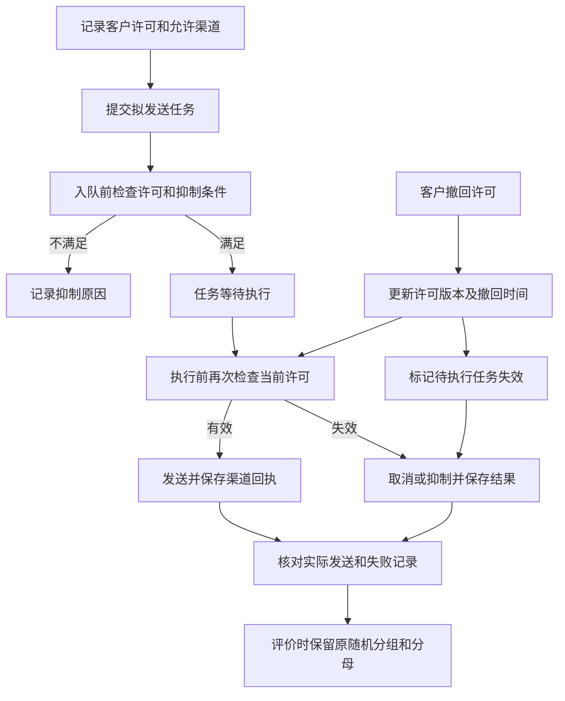

# GRCS许可控制流程与测试练习

吕滢滢｜2026年10月10日｜养老金案例配套材料

本练习将许可撤回控制拆成业务流程、访谈问题、风险和测试底稿，供GRCS面试展示。流程是拟议银行流程；已有Alpha证据仅覆盖本地虚构案例，未开展银行现场穿行或生产控制验收。

## 一 业务流程和控制位置

关键假设：撤回后的新主动发送应停止；撤回不当然表示已经提交给渠道的消息能够收回。并发、执行时间点和渠道能力需要事先约定并通过日志验证，不能仅比较前端按钮状态。

| 步骤 | 拟议责任方 | 要取得的证据 | 当前取得情况 |
| --- | --- | --- | --- |
| 记录及更新许可 | 业务与渠道 | 许可范围、版本、时间、撤回记录 | 无真实银行记录 |
| 入队和执行前检查 | 渠道与技术 | 任务ID、客户标识、检查时间、使用许可版本 | 仅本地规则演示 |
| 取消和抑制 | 渠道与技术 | 任务状态、取消结果、失败与重试记录 | 未接队列 |
| 回执与例外复核 | 渠道与业务 | 实际发送时间、渠道回执、例外处理 | 无真实回执 |
| 结果评价 | 数据与评价人员 | 原始分组、入组快照、结果处理记录 | 固定模拟分组与原型断言 |

## 二 现场访谈提纲

1. 客户许可由哪个系统记录？哪些渠道、用途和有效期间被记录？
2. 客户在哪里可以撤回？各入口是否更新同一许可记录？
3. 任务入队时使用哪个版本？执行前是否再次检查？
4. 撤回与发送并发时，系统如何排序，采用哪些时间字段？
5. 已排队、执行中、已提交渠道的任务分别怎样处理？
6. 取消失败、超时或重试由谁检查？是否会沿用旧许可？
7. 发送回执是否能关联任务与许可检查，缺失回执如何管理？
8. 是否有拒绝、频控和其他抑制条件？渠道之间怎样统一？
9. 撤回后，试点评价的原始组别与分母怎样保留？
10. 谁复核例外？整改后怎样测试并确认关闭？

每个回答记录受访角色、日期、系统版本及资料出处。当前没有完成上述访谈，不能把提纲写成现场调查成果。

## 三 控制测试底稿

**控制编号：** 对应原矩阵R02。**风险：** 入队后许可发生变化，执行端或重试沿用旧状态。**拟议目标：** 发送前使用当前有效许可；失效任务有抑制或取消记录；评价保留原组别。

**设计检查：** 对照流程、许可字段、队列状态和执行规则，确认撤回能传递到执行端；明确并发和渠道提交后的边界。当前只有本地规则和拟议流程，设计文件与真实系统一致性未核验。

**穿行程序：** 选取一笔经许可生成且在发送前发生撤回的真实任务，串联许可、入队、撤回、取消及回执。穿行用于理解流程，不能以一笔通过代表期间有效。当前真实样本未取得。

**执行有效性程序：** 先明确期间、总体、完整性和抽样方式，再检查样本的关键字段及异常；覆盖正常发送、入队后撤回、执行前撤回、重试、取消失败和缺失回执。当前不填写样本量或通过率。

| 测试情景 | 预期检查点 | 应取得证据 | 状态 |
| --- | --- | --- | --- |
| 许可有效且范围匹配 | 发送前检查使用当前版本 | 许可、检查日志、回执 | 待验证 |
| 入队后撤回 | 执行前拦截，任务状态可追溯 | 撤回、任务、取消或抑制日志 | 待验证 |
| 发送与撤回并发 | 按事先定义的时序判断 | 一致时钟、事件顺序、渠道提交边界 | 待验证 |
| 失败后重试 | 重试重新读取当前许可 | 重试任务、许可版本、执行日志 | 待验证 |
| 取消失败或回执缺失 | 例外被识别、复核并处置 | 告警、工单及处理记录 | 待验证 |
| 撤回后的评价 | 不删除原随机组与入组分母 | 入组快照、评价数据与复算 | 原型固定案例通过；真实评价待验证 |

## 四 已有证据如何放入底稿

Alpha U103路径是“进入判断→撤回许可→请求人工→查看任务卡”。原测试断言确认发送资格为false、N1保留，任务卡含`CHANNEL_REVOKED`；导出JSON保留原T组和规则版本。它证明固定规则路径的受测行为，未证明真实队列取消、发送和重试。

原矩阵“许可测试底稿”采用人为植入缺陷的8条模拟记录：其中3条在撤回时点或之后发送，另1条缺发送时间。它展示如何识别排队后撤回与缺失时间问题；这不是Alpha实测发现，也不是银行控制缺陷。

面试展示时，可以同时打开[原型检查记录](https://github.com/Yumm-del/gongyin-zhiyangcang-public-selftest/blob/main/consulting-case/evidence/Alpha-v3.4-复核检查记录-20261010.json)和[模拟发现说明](https://github.com/Yumm-del/gongyin-zhiyangcang-public-selftest/blob/main/consulting-case/docs/养老金咨询案例-模拟测试发现与分析.md)，解释两种证据的用途。

## 五 发现报告和关闭标准

如果真实测试发现发送晚于撤回，应先核对时钟、撤回生效定义、渠道提交时点和重复记录，再确定是否违反既定控制。报告列明事实、证据、标准、影响、原因及整改建议；缺证据事项单列，不自动判通过或失败。

拟议整改包括执行前重新核许可、使待执行任务失效、重试重核许可以及例外回执复核。建议实施后，要重新执行相关情景，保存版本、样本与结果，由适当人员复核再关闭。当前没有真实整改，也没有生产控制关闭记录。

这一页材料可以支持“我如何设计和组织控制分析”的讲解。简历仍使用“拟议控制”和“模拟底稿”，保持与实际完成工作一致。
